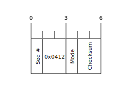
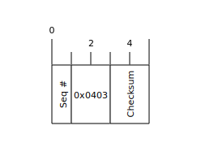
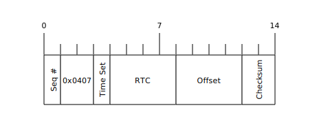
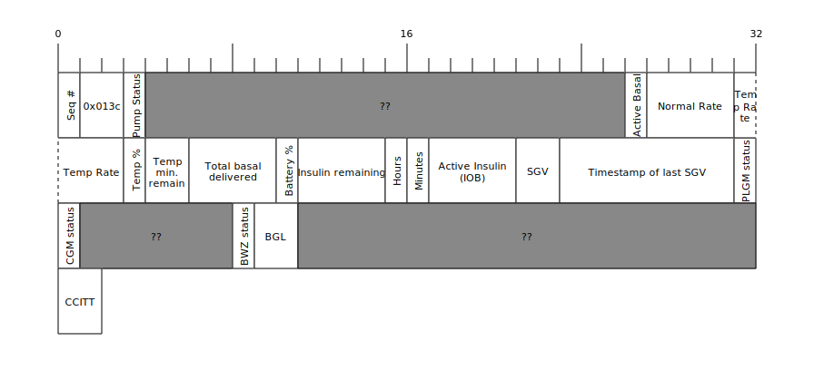
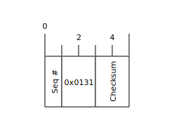
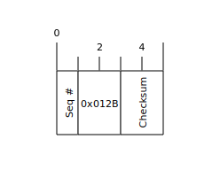
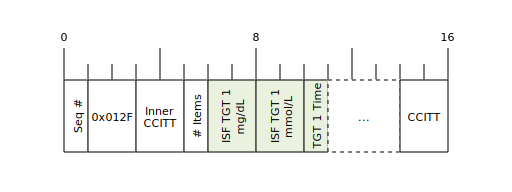
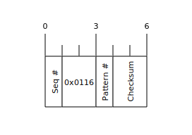
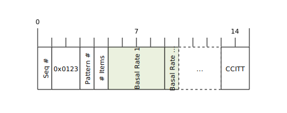

# Medtronic 600-series message structure

Below we've documented the structure of the various packets for the Medtronic 600-series pump, matching the fields and record types to our [data model](http://developer.tidepool.io/data-model). Unknown bits are designated with `??`.

## Bayer Contour Next Link messages

### USB Packet
All other messages are broken down to USB packets before being sent on the HID interface.

| Field     | Bytes | Data Type  |   Comments   |
|-----------|:-----:|:----------:|--------------|
| Header    | 3     | String     | `'ABC'`      |
| Payload size | 1     | UInt8      |              |
| Payload   | 60    | Bytes      | |

### MiniMed Message
A **MiniMed Message** is broken up into [USB Packet](#usb-packet)s.

| Field     | Bytes | Data Type  |   Comments   |
|-----------|:-----:|:----------:|--------------|
| Header    | 1     | Byte      | `0x51`      |
| Device Type | 1     | Byte      | *See table below*     |
| Pump Serial Number | 6     | String     | ASCII numbers, always `'000000'` for 600-series |
| Padding   | 10    | Bytes      | Null Padded  |
| Operation | 1     | Byte       | *See table below* |
| Sequence Number | 4     | UInt32LE   | |
| Padding   | 5     | Bytes      | Null Padded  |
| Payload Size | 2     | UInt16LE   | |
| Padding   | 2     | Bytes      | Null Padded  |
| Checksum  | 1     | UInt8      | Sum of the *entire* message, not including the **Checksum** byte itself  |
| Payload   | Variable | Bytes      | Size specified by **Payload Size** |

#### Device Type
| Value     | Operation                  |
|-----------|----------------------------|
| `0x01`    |  Paradigm. AKA 5/7 series  |
| `0x02`    |  Guardian Connect          |
| `0x03`    |  Next Generation Pump (NGP). AKA 600-series. |

#### Operation
| Value     | Operation                  |
|-----------|----------------------------|
| `0x10`    |  OPEN_CONNECTION           |
| `0x11`    |  CLOSE_CONNECTION          |
| `0x12`    |  SEND_MESSAGE              |
| `0x14`    |  READ_INFO                 |
| `0x16`    |  REQUEST_LINK_KEY          |
| `0x17`    |  SEND_LINK_KEY             |
| `0x80`    |  RECEIVE_MESSAGE           |
| `0x81`    |  SEND_MESSAGE_RESPONSE     |
| `0x86`    |  REQUEST_LINK_KEY_RESPONSE |

### Open Connection Request
An **Open Connection Request** is sent from the driver to the Contour Next Link 2.4 to authenticate with it.
An **Open Connection Request** is contained in the payload of a [MiniMed Message](#minimed-message) where the Minimed Operation is `0x10` (OPEN_CONNECTION).

| Field     | Bytes | Data Type  |   Comments   |
|-----------|:-----:|:----------:|--------------|
| HMAC      | 32    | Bytes      | The HMAC is generated using a proprietary algorithm from the Contour Next Link 2.4's **Model and Serial Number** string, which is obtained from the Header ASTM response from sending the initial **X** message to the CNL2.4 |

### Open Connection Response
The **Open Connection Response** is currently ignored by the driver.

### Read Info Request
A **Read Info Request** is sent from the driver to the Contour Next Link 2.4 to determine whether the CNL2.4 is paired with a 600-series pump.
A **Read Info Request** is contained in the payload of a [MiniMed Message](#minimed-message) where the Minimed Operation is `0x14` (READ_INFO). It has no message payload.

### Read Info Response
A **Read Info Response** is contained in the payload of a [MiniMed Message](#minimed-message) where the Minimed Operation is `0x14` (READ_INFO).

| Field     | Bytes | Data Type  |   Comments   |
|-----------|:-----:|:----------:|--------------|
| CNL MAC   | 8     | UInt64BE   | IEEE 802.15.4 MAC Address of the Contour Next Link |
| Pump MAC  | 8     | UInt64BE   | IEEE 802.15.4 MAC Address of the 600-series pump |
| Link Counter  | 2     | UInt16LE   | Number of times that this CNL/Pump combination have been paired |
| Mode Flags    | 1     | Byte       | Mode flags for this pairing. If the lowest bit is set, encryption is enabled |

### Link Key Request
A **Link Key Request** is sent from the driver to the Contour Next Link 2.4 to get the Link Key for the paired CNL and pump. The Link Key is used to generate the encryption key for the AES encoded data later in the session.
A **Link Key Request** is contained in the payload of a [MiniMed Message](#minimed-message) where the Minimed Operation is `0x16` (REQUEST_LINK_KEY). It has no message payload.

### Link Key Response
A **Link Key Response** is contained in the payload of a [MiniMed Message](#minimed-message) where the Minimed Operation is `0x86` (REQUEST_LINK_KEY_RESPONSE).

| Field     | Bytes | Data Type  |   Comments   |
|-----------|:-----:|:----------:|--------------|
| Link Key  | 55    | Bytes      | Link Key for the current CNL/pump pairing |

The key for the AES encrypted data in **NGP Message**s is generated using a proprietary algorithm based on the Link Key.

### NGP Message
An **NGP Message** is contained in the payload of a [MiniMed Message](#minmed-message) where the MiniMed Operation is `0x12` (SEND_MESSAGE), `0x80` (RECEIVE_MESSAGE) or `0x81` (SEND_MESSAGE_RESPONSE).

| Field     | Bytes | Data Type  |   Comments   |
|-----------|:-----:|:----------:|--------------|
| Command   | 1     | Byte       | *See table below* |
| Size      | 1     | UInt8      | Size of the Payload and Checksum |
| Payload   | Variable | Bytes      | Size specified by **Size - 2** |
| CRC       | 2     | UInt16LE   | CCITT checksum of the message (**Command**, **Size** and **Payload**) |

#### Command
| Value     | Operation |
|-----------|-----------|
| `0x01`    | INITIALIZE |
| `0x02`    | SCAN_NETWORK |
| `0x03`    | JOIN_NETWORK |
| `0x04`    | LEAVE_NETWORK |
| `0x05`    | TRANSMIT_PACKET |
| `0x06`    | READ_DATA |
| `0x07`    | READ_STATUS |
| `0x08`    | READ_NETWORK_STATUS |
| `0x0c`    | SET_SECURITY_MODE |
| `0x0d`    | READ_STATISTICS |
| `0x0e`    | SET_RF_MODE |
| `0x10`    | CLEAR_STATUS |
| `0x14`    | SET_LINK_KEY |
| `0x55`    | COMMAND_RESPONSE |

### Join Network Request

A **Join Network Request** is sent from the driver to the Contour Next Link 2.4 to attempt to join the pump's IEEE 802.15.4 network.
A **Join Network Request** is contained in the payload of a [NGP Message](#ngp-message) where the Command is `0x03` (JOIN_NETWORK).

| Field     | Bytes | Data Type  |   Comments   |
|-----------|:-----:|:----------:|--------------|
| Sequence Number  | 1     | UInt8      | NGP Sequence Number (always 1 when a `Join Network Request`) |
| Radio Channel    | 1     | UInt8      | IEEE 802.15.4 radio channel to try comms on. *See table below* |
| Padding   | 3     | Bytes      | Null Padded  |
| `0x07`    | 1     | Byte       | Unknown meaning |
| `0x07`    | 1     | Byte       | Unknown meaning |
| Padding   | 2     | Bytes      | Null Padded  |
| `0x02`    | 1     | Byte       | Unknown meaning |
| CNL MAC   | 8     | UInt64LE   | IEEE 802.15.4 MAC Address of the Contour Next Link |
| Pump MAC   | 8     | UInt64LE   | IEEE 802.15.4 MAC Address of the 600-series pump |

#### Radio Channels
| Channel   | Comments |
|-----------|-----------|
| `0x0E`    | Channel 14 - 2420MHz |
| `0x11`    | Channel 17 - 2435MHz |
| `0x14`    | Channel 20 - 2450MHz |
| `0x17`    | Channel 23 - 2465MHz |
| `0x1A`    | Channel 26 - 2480MHz |

### Join Network Response

| Field     | Bytes | Data Type  |   Comments   |
|-----------|:-----:|:----------:|--------------|
| `0x00`    | 1     | Byte       | Unknown meaning |
| `0x04`    | 1     | Byte       | Unknown meaning |
| Pump Serial | 5     | Bytes      | The pump's serial as a 40-bit unsigned LE integer |
| `0x02`    | 1     | Byte       | Unknown meaning |
| Pump MAC   | 8     | UInt64LE   | IEEE 802.15.4 MAC Address of the 600-series pump |
| `0x82`    | 1     | Byte       | Exact meaning unknown, but is `0x82` if the network has been joined |
| Padding   | 5     | Bytes      | Null Padded  |
| `0x07`    | 1     | Byte       | Unknown meaning |
| Padding   | 1     | Byte       | Null Padded  |
| `0x28`    | 1     | Byte       | Unknown meaning |
| CNL MAC    | 8     | UInt64LE   | IEEE 802.15.4 MAC Address of the Contour Next Link 2.4 |
| `0x42`    | 1     | Byte       | Exact meaning unknown, but is `0x42` if the network has been joined |
| Padding   | 7     | Bytes      | Null Padded  |
| Radio Channel | 1     | UInt8      | IEEE 802.15.4 radio channel on which the network has been joined. |

If the network is not joined, the response has a payload of 9 bytes, whose structure is currently unknown.

### Transmit Packet Request
A **Transmit Packet Request** is contained in the payload of an [NGP Message](#ngp-message) where the Command is `0x05` (TRANSMIT_MESSAGE).

| Field     | Bytes | Data Type  |   Comments   |
|-----------|:-----:|:----------:|--------------|
| Pump MAC   | 8     | UInt64LE   | IEEE 802.15.4 MAC Address of the 600-series pump |
| Sequence Number  | 1     | UInt8      | NGP Sequence Number |
| Mode Flags    | 1     | Byte       | Mode flags for this message. *See table below* |
| Size      | 1     | UInt8      | Size of the Encrypted Payload |
| Encrypted Payload | Variable | Bytes      | Size specified by **Size** |

The encryption mechanism is AES using CFB Mode (`AES/CFB/NoPadding` in Java, `aes-128-cfb` in the Node Crypto library).  
The key is determined from the **Link Key Request**, and the IV is the same as the key, but the first byte is changed to the **Radio Channel** on which the CNL and Pump are connected.

#### Mode Flags
| Flag      | Meaning  |
|-----------|-----------|
| `0x01`    | Encryption enabled |
| `0x10`    | High Speed enabled |

Mode flags can be `|`ed together. For example, if both encrypted and high speed mode were enabled, the Mode Flags byte would be `0x11`.

### Transmit Packet Response
A **Transmit Packet Response** is contained in the payload of an [NGP Message](#ngp-message) where the Command is `0x55` (COMMAND_RESPONSE) and the MiniMed Operation is `0x80`.

| Field     | Bytes | Data Type  |   Comments   |
|-----------|:-----:|:----------:|--------------|
| `0x00`    | 1     | Byte       | Unknown meaning |
| `0x06`    | 1     | Byte       | Unknown meaning |
| Pump MAC   | 8     | UInt64LE   | IEEE 802.15.4 MAC Address of the 600-series pump |
| CNL MAC    | 8     | UInt64LE   | IEEE 802.15.4 MAC Address of the Contour Next Link 2.4 |
| Sequence Number  | 1     | UInt8      | NGP Sequence Number |
| Unknown bytes    | 2     | Bytes       | Unknown meaning |
| Size      | 1     | UInt8      | Size of the Encrypted Payload |
| Encrypted Payload | Variable | Bytes      | Size specified by **Size** |

### High Speed Mode Command
A **High Speed Mode Command** is contained in the payload of a [Transmit Packet Request](#transmit-packet-request).

| Field     | Bytes | Data Type  |   Comments   |
|-----------|:-----:|:----------:|--------------|
| Sequence Number  | 1     | UInt8      | Transmit Packet Request Sequence Number - always `0x80` for the High Speed Mode Command |
| Command   | 2     | UInt16BE   | `0x0412` |
| Mode      | 1     | Byte       | `0x00` to Enable  `0x01` to Disable |
| Checksum  | 2     | UInt16BE   | CCITT checksum of this message, not including the Checksum |

### Pump Time Command
A **Pump Time Command** is contained in the payload of a [Transmit Packet Request](#transmit-packet-request).

| Field     | Bytes | Data Type  |   Comments   |
|-----------|:-----:|:----------:|--------------|
| Sequence Number  | 1     | UInt8      | Transmit Packet Request Sequence Number |
| Command   | 2     | UInt16BE   | `0x0403` |
| Checksum  | 2     | UInt16BE   | CCITT checksum of this message, not including the Checksum |

### Pump Time Response
A **Pump Time Response** is contained in the payload of a [Transmit Packet Request](#transmit-packet-request).

| Field     | Bytes | Data Type  |   Comments   |
|-----------|:-----:|:----------:|--------------|
| Sequence Number  | 1     | UInt8      | Transmit Packet Request Sequence Number |
| Command   | 2     | UInt16BE   | `0x0407` |
| RTC       | 4     | UInt32BE   | The "Real Time Clock" part of the date/time |
| Offset    | 4     | UInt32BE   | The "Offset" part of the date/time |
| Checksum  | 2     | UInt16BE   | CCITT checksum of this message, not including the Checksum |

#### NGP Date Format
All timestamps in the 600-series protocol messages are represented with the RTC/Offset byte structure.  
This structure can be converted to a date using the following algorithm:  
`946684800000 + (RTC * 1000) + ((Offset - 0x100000000) * 1000)`

This returns a number in milliseconds which can be passed to a `Date` object. Note that this is the date in the *local* timezone, **not** in UTC.

### Pump Status Command
A **Pump Status Command** is contained in the payload of a [Transmit Packet Request](#transmit-packet-request).

| Field     | Bytes | Data Type  |   Comments   |
|-----------|:-----:|:----------:|--------------|
| Sequence Number  | 1     | UInt8      | Transmit Packet Request Sequence Number |
| Command   | 2     | UInt16BE   | `0x0112` |
| Checksum  | 2     | UInt16BE   | CCITT checksum of this message, not including the Checksum |

### Pump Status Response
A **Pump Status Response** is contained in the payload of a [Transmit Packet Request](#transmit-packet-request).

| Field     | Bytes | Data Type  |   Comments   |
|-----------|:-----:|:----------:|--------------|
| Sequence Number  | 1     | UInt8      | Transmit Packet Request Sequence Number |
| Command   | 2     | UInt16BE   | `0x013c` |
| Pump Status | 1     | Byte       | Bitfield of pump status. *See table below* |
| Unknown bytes    | 22    | Bytes       | Unknown meaning |
| Active Basal Pattern | 1     | UInt8      | *See table below* |
| Normal Rate | 4     | UInt32BE   | Current basal rate for the active pattern. Divide by 10000 to get Units |
| Temp Rate | 4     | UInt32BE   | Temp basal rate (only if an absolute temp basal is in progress). Divide by 10000 to get Units |
| Temp % | 1     | UInt8      | Temp basal percentage (only if a Percentage temp basal is in progress). |
| Temp min. remain | 2     | UInt16BE   | Number of minutes remaining for the current temp basal period |
| Total basal delivered | 4     | UInt32BE   | Total amount of insulin delivered today. Divide by 10000 to get Units |
| Battery % | 1     | UInt8      | Percentage of charge left in the pump battery |
| Insulin remaining | 4     | UInt32BE   | Total amount of insulin left in the reservoir. Divide by 10000 to get Units |
| Hours | 1     | UInt8      | Estimated number of hours until reservoir is empty. If the value is `25`, it means "More than 24 hours" |
| Minutes | 1     | UInt8      | Additional estimated number of minutes until reservoir is empty. Add to the **Hours** field |
| Active Insulin (IOB) | 4     | UInt32BE   | Divide by 10000 to get Units |
| SGV       | 2     | UInt16BE   | CGM sensor subcutaneous blood glucose value, in mg/dL |
| Timestamp of last SGV | 8     | NGPTimestamp | NGP Timestamp of last CGM sensor reading |
| PLGM Status | 1     | Byte       | Bitfield of the Predictive Low Glucose Monitoring status of the pump |
| CGM Status | 1     | Byte       | Bitfield of the CGM status, including rates of change |
| Unknown bytes    | 7     | Bytes       | Unknown meaning |
| BWZ Status | 1     | Byte       | Bitfield of the Bolus Wizard status. `0x01` if the Bolus Wizard has been used in the last 15 minutes |
| BGL       | 2     | UInt16BE   | Blood Glucose Level entered into the Bolus Wizard, in mg/dL |
| Unknown bytes    | 21    | Bytes       | Unknown meaning |
| CCITT     | 2     | UInt16BE   | CCITT checksum of this message, not including the Checksum |

#### Pump Status Flags
| Flag      | Meaning  |
|-----------|-----------|
| `00000001` | Pump suspended |
| `00000010` | Bolusing |
| `00010000` | Active (delivering insulin) |
| `00100000` | Temp basal active |
| `01000000` | CGM Active |

#### Basal Patterns
| Value | Meaning   |
|-------|-----------|
| 1     | Pattern 1 |
| 2     | Pattern 2 |
| 3     | Pattern 3 |
| 4     | Pattern 4 |
| 5     | Pattern 5 |
| 6     | Work Day  |
| 7     | Day Off   |
| 8     | Sick Day  |

### Bolus Wizard BG Targets Command
A **Bolus Wizard BG Targets Command** is contained in the payload of a [Transmit Packet Request](#transmit-packet-request).

| Field     | Bytes | Data Type  |   Comments   |
|-----------|:-----:|:----------:|--------------|
| Sequence Number  | 1     | UInt8      | Transmit Packet Request Sequence Number |
| Command   | 2     | UInt16BE   | `0x0131` |
| Checksum  | 2     | UInt16BE   | CCITT checksum of this message, not including the Checksum |

### Bolus Wizard BG Targets Response
A **Bolus Wizard BG Targets Response** is contained in the payload of a [Transmit Packet Request](#transmit-packet-request).

| Field     | Bytes | Data Type  |   Comments   |
|-----------|:-----:|:----------:|--------------|
| Sequence Number  | 1     | UInt8      | Transmit Packet Request Sequence Number |
| Command   | 2     | UInt16BE   | `0x0132` |
| Inner CCITT  | 2     | UInt16BE   | CCITT checksum of Byte 5 onwards, not including the CCITT at the end |
| # Items  | 1     | UInt8      | The number of Bolus Wizard targets |
| High TGT 1 mg/dL  | 2     | UInt16BE   | The first high target (in mg/dL) |
| High TGT 1 mmol/L  | 2     | UInt16BE   | The first high target (in mmol/L * 10) |
| Low TGT 1 mg/dL  | 2     | UInt16BE   | The first low target (in mg/dL) |
| Low TGT 1 mmol/L  | 2     | UInt16BE   | The first low target (in mmol/L * 10) |
| TGT 1 Time  | 1     | UInt8      | Time from which this target applies, in half hour units. For example, `0` means midnight, `1` means 00:30, and so on |
| ...  | Variable | Bytes      | If **# Items** is greater than 1, the pattern (Bytes 6 to 14, shown in green) are repeated for their respective target details. |
| CCITT  | 2     | UInt16BE   | CCITT checksum of this message, not including the Checksum |

### Bolus Wizard Carb Ratios Command
A **Bolus Wizard Carb Ratios Command** is contained in the payload of a [Transmit Packet Request](#transmit-packet-request).

| Field     | Bytes | Data Type  |   Comments   |
|-----------|:-----:|:----------:|--------------|
| Sequence Number  | 1     | UInt8      | Transmit Packet Request Sequence Number |
| Command   | 2     | UInt16BE   | `0x012B` |
| Checksum  | 2     | UInt16BE   | CCITT checksum of this message, not including the Checksum |

### Bolus Wizard Carb Ratios Response
A **Bolus Wizard Carb Ratios Response** is contained in the payload of a [Transmit Packet Request](#transmit-packet-request).

| Field     | Bytes | Data Type  |   Comments   |
|-----------|:-----:|:----------:|--------------|
| Sequence Number  | 1     | UInt8      | Transmit Packet Request Sequence Number |
| Command   | 2     | UInt16BE   | `0x012C` |
| Inner CCITT  | 2     | UInt16BE   | CCITT checksum of Byte 5 onwards, not including the CCITT at the end |
| # Items  | 1     | UInt8      | The number of Bolus Wizard targets |
| Ratio TGT 1 grams  | 4     | UInt32BE   | The first carb ratio (in grams) |
| Unknown bytes  | 4     | Bytes      | Meaning unknown, but could be a ratio if Exchanges are used |
| Ratio 1 Time  | 1     | UInt8      | Time from which this ratio applies, in half hour units. For example, `0` means midnight, `1` means 00:30, and so on |
| ...  | Variable | Bytes      | If **# Items** is greater than 1, the pattern (Bytes 6 to 14, shown in green) are repeated for their respective target details. |
| CCITT  | 2     | UInt16BE   | CCITT checksum of this message, not including the Checksum |

### Bolus Wizard Sensitivity Factors Command
A **Bolus Wizard Sensitivity Factors Command** is contained in the payload of a [Transmit Packet Request](#transmit-packet-request).

| Field     | Bytes | Data Type  |   Comments   |
|-----------|:-----:|:----------:|--------------|
| Sequence Number  | 1     | UInt8      | Transmit Packet Request Sequence Number |
| Command   | 2     | UInt16BE   | `0x012E` |
| Checksum  | 2     | UInt16BE   | CCITT checksum of this message, not including the Checksum |

### Bolus Wizard Sensitivity Factors Response
A **Bolus Wizard Sensitivity Factors Response** is contained in the payload of a [Transmit Packet Request](#transmit-packet-request).

| Field     | Bytes | Data Type  |   Comments   |
|-----------|:-----:|:----------:|--------------|
| Sequence Number  | 1     | UInt8      | Transmit Packet Request Sequence Number |
| Command   | 2     | UInt16BE   | `0x012F` |
| Inner CCITT  | 2     | UInt16BE   | CCITT checksum of Byte 5 onwards, not including the CCITT at the end |
| # Items  | 1     | UInt8      | The number of Bolus Wizard targets |
| ISF TGT 1 mg/dL  | 2     | UInt16BE   | The first insulin sensitivity factor (in mg/dL) |
| ISF TGT 1 mmol/L  | 2     | UInt16BE   | The first insulin sensitivity factor (in mmol/L) |
| Ratio 1 Time  | 1     | UInt8      | Time from which this ratio applies, in half hour units. For example, `0` means midnight, `1` means 00:30, and so on |
| ...  | Variable | Bytes      | If **# Items** is greater than 1, the pattern (Bytes 6 to 10, shown in green) are repeated for their respective target details. |
| CCITT  | 2     | UInt16BE   | CCITT checksum of this message, not including the Checksum |

### Read Basal Pattern Command
A **Read Basal Pattern Command** is contained in the payload of a [Transmit Packet Request](#transmit-packet-request).

| Field     | Bytes | Data Type  |   Comments   |
|-----------|:-----:|:----------:|--------------|
| Sequence Number  | 1     | UInt8      | Transmit Packet Request Sequence Number |
| Command   | 2     | UInt16BE   | `0x0116` |
| Pattern # | 1     | UInt8      | The number of the [basal pattern](#basal-patterns) to request. |
| Checksum  | 2     | UInt16BE   | CCITT checksum of this message, not including the Checksum |

### Read Basal Pattern Response
A **Read Basal Pattern Response** is contained in the payload of a [Transmit Packet Request](#transmit-packet-request).

| Field     | Bytes | Data Type  |   Comments   |
|-----------|:-----:|:----------:|--------------|
| Sequence Number  | 1     | UInt8      | Transmit Packet Request Sequence Number |
| Command   | 2     | UInt16BE   | `0x0123` |
| Pattern # | 1     | UInt8      | The number of this [basal pattern](#basal-patterns). |
| # Items  | 1     | UInt8      | The number of segments in this basal pattern |
| Basal Rate 1 | 2     | UInt32BE   | The first basal rate. Divide by 10000 to get Units |
| Rate 1 Time  | 1     | UInt8      | Time from which this basal rate applies, in half hour units. For example, `0` means midnight, `1` means 00:30, and so on |
| ...  | Variable | Bytes      | If **# Items** is greater than 1, the pattern (Bytes 5 to 9, shown in green) are repeated for their respective basal rate details. |
| CCITT  | 2     | UInt16BE   | CCITT checksum of this message, not including the Checksum |
